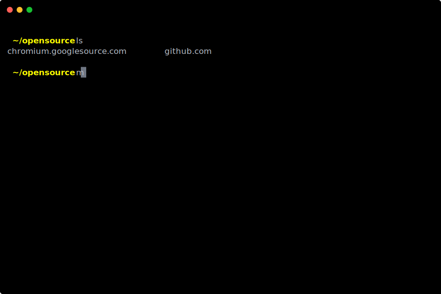

[](https://pkg.go.dev/github.com/eighty4/maestro)
[](https://github.com/eighty4/maestro/actions/workflows/verify.yml)

# Maestro

A developer utility.

## Installing

Prebuilt binaries are available [here on GitHub](https://github.com/eighty4/maestro/releases/latest)

Linux and Mac users can run
```bash
curl -fsSL https://maestro.eighty4.tech/install.sh | sh
```

With Go 1.19 or later, you can install from source
```bash
go install github.com/eighty4/maestro@latest
```

## Syncing with `maestro git`

Keep your workspace in sync with the `maestro git` command. This command performs a `git pull --ff-only` in each
repository found nested within two subdirectories deep from the current working directory.



A `maestro.yaml` file allows repositories to be configured, enabling a `maestro git` command to also clone repositories
not already present in the workspace. Eventually this feature could be used to enable an export/import workflow with a
dev machine's workspaces before formatting or replacing hardware. Configuring a `maestro.yaml` example is
[in the tests](config_test.go#L41).

## Workspace APIs

[maestro/git](git) provides the APIs for syncing a multi-repository workspace. `git.NewWorkspace` scans a directory for
git repositories and provides access to the `Workspace.Sync` operation. Syncing delegates to `git.Clone` and `git.Pull`
for each `git.Repository` configured with the workspace whether it's present or absent on within the workspace dir.

The [maestro/composable](composable) module has wrappers for `exec.Cmd` to be used for managing local development
processes and performing process healthchecks with HTTP GET and shell commands.
[Previous iterations](https://github.com/eighty4/maestro/tree/b0c01b535b79a2fc0b9d553a7b18dd4697f74beb) could configure
Gradle tasks, npm scripts and shell commands from a `.maestro` file.
Re-visiting the project with the opportunity to use new Go [tooling](https://go.dev/doc/tutorial/workspaces) and
[language](https://go.dev/doc/tutorial/generics) features (workspaces and generics), I rewrote process management
but have yet to reimplement configuring and managing a local development environment.
